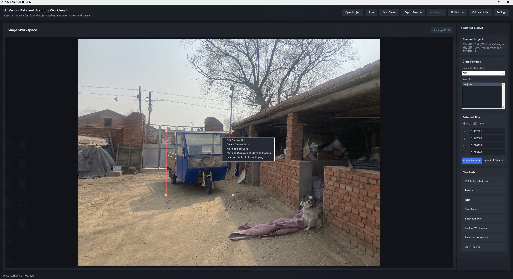
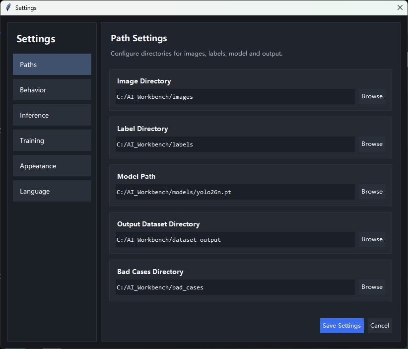
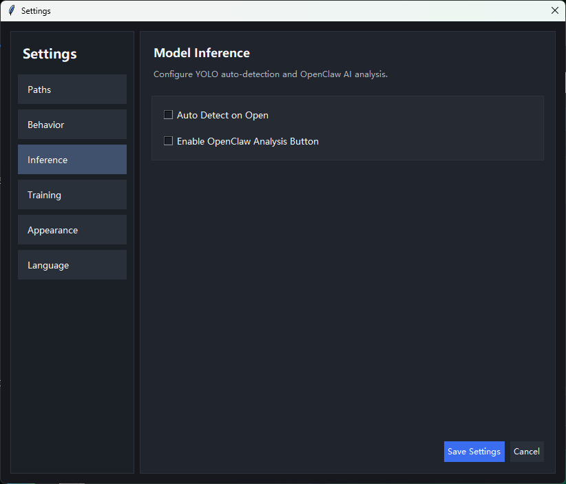
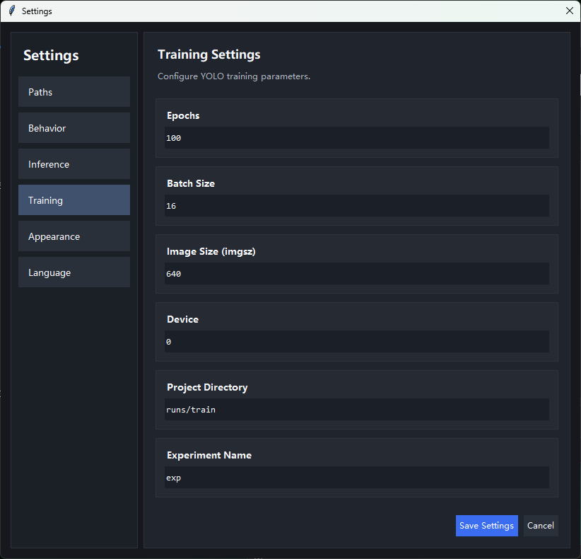
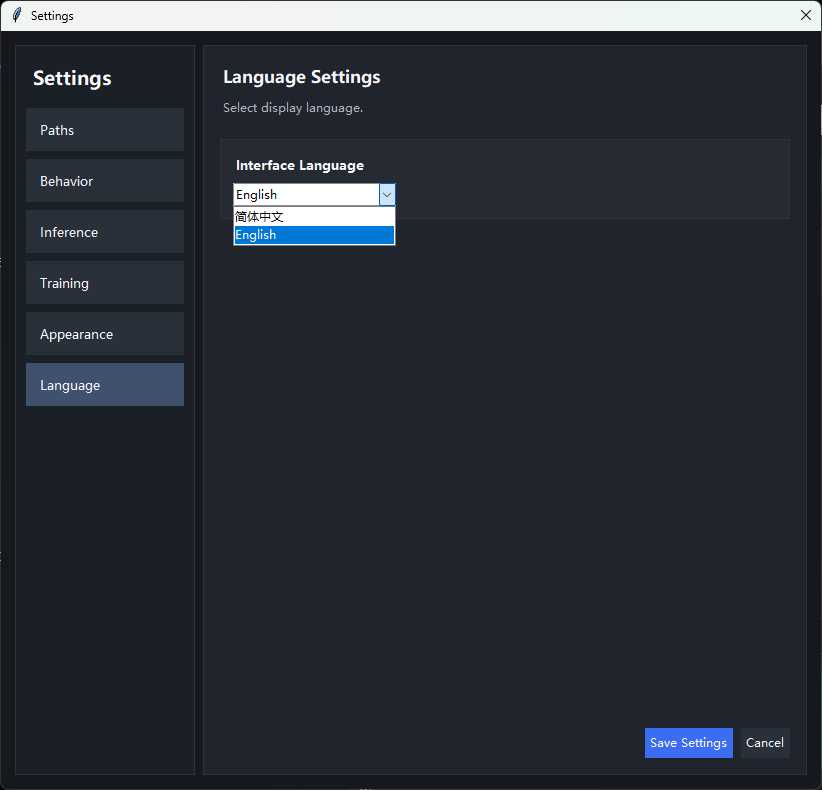

# AI Vision Data and Training Workbench Preview v0.3.0
# AI视觉数据与训练工作台 预览版 v0.3.0

A local-first Windows workbench preview for visual dataset review, annotation workflow exploration, and model-assisted image workflow presentation.
一个面向 Windows 的本地优先工作台预览版，用于视觉数据检查、标注工作流探索，以及模型辅助图像工作流展示。

> **Status / 当前状态**
>
> This is a preview release focused on usability, structure, and release packaging polish. It is intended for evaluation, testing, and iterative feedback.
>
> 这是一个以可用性、结构化界面和发布打磨为重点的预览版本，适合测试、体验和收集反馈。

---

## Quick Start for Most Users / 普通用户快速开始

1. Download the latest preview package from **Releases**.
2. Extract the zip package to a local folder.
3. Double-click `start_ui.bat`.
4. Wait for the UI to launch.
5. Open Settings and confirm your local paths before use.

1. 从 **Releases** 下载最新预览版压缩包。
2. 解压到本地文件夹。
3. 双击 `start_ui.bat`。
4. 等待界面启动。
5. 使用前先进入设置页面确认本地路径。

### What you need / 你需要准备什么

- Windows 10 or Windows 11
- Python 3.10 recommended
- A local folder where you can read and write files

- Windows 10 或 Windows 11
- 推荐 Python 3.10
- 一个可正常读写的本地目录

---

## Current Highlights / 当前亮点

- Local-first desktop preview workflow
- Structured settings pages
- Path configuration for images, labels, models, outputs, and bad cases
- One-click launcher for preview users
- Bilingual project presentation
- Early-stage workflow evaluation interface

- 本地优先的桌面预览工作流
- 结构化设置页面
- 支持图片、标签、模型、输出和 bad cases 路径配置
- 面向预览用户的一键启动入口
- 中英双语项目展示
- 面向早期评估的工作流界面

---

## UI Preview / 界面预览

### 01 - Main UI / 主界面


### 02 - Path Settings / 路径设置


### 03 - Inference Settings / 推理设置


### 04 - Training Settings / 训练设置


### 05 - Language Settings / 语言设置


---

## Current Scope / 当前范围

This preview currently focuses on:
- UI structure and navigation
- Local path configuration
- Preview-stage launcher experience
- Workflow direction presentation

当前版本主要聚焦于：
- 界面结构与导航
- 本地路径配置
- 预览版启动体验
- 工作流方向展示

---

## Not Fully Included Yet / 当前尚未完全开放

The following areas are still in progress:
- Full training execution pipeline
- Training curve visualization
- GPU monitoring and advanced hardware diagnostics
- Full plugin architecture
- Deeper automation workflows

以下内容仍在持续开发中：
- 完整训练执行链路
- 训练曲线可视化
- GPU 监控与更深入的硬件诊断
- 完整插件架构
- 更深层的自动化工作流

---

## Advanced Setup / 进阶手动启动

For advanced users who want to run the project manually:

```bash
conda create -n ai_workbench python=3.10 -y
conda activate ai_workbench
python -m pip install --upgrade pip
pip install -r requirements.txt
python main.py
```

适合希望手动运行项目的进阶用户：

```bash
conda create -n ai_workbench python=3.10 -y
conda activate ai_workbench
python -m pip install --upgrade pip
pip install -r requirements.txt
python main.py
```

---

## Recommended Environment / 推荐环境

- OS: Windows 10 / Windows 11
- Python: 3.10 recommended
- NVIDIA GPU recommended but not required for preview
- Local writable project directory

- 系统：Windows 10 / Windows 11
- Python：推荐 3.10
- 预览体验推荐 NVIDIA GPU，但不是必须
- 需要本地可写项目目录

---

## Release Notes / 发布说明

This repository is being cleaned and structured for a more formal preview release workflow.
Current direction: clearer documentation, cleaner repository layout, safer release packaging.

此仓库正在朝更正式的预览发布流程进行整理。
当前方向：更清晰的说明文档、更干净的仓库结构、更稳妥的发布包装。

---

## Download / 下载

Please use the latest package from the repository Releases page.
请从仓库 Releases 页面下载最新发布包。
